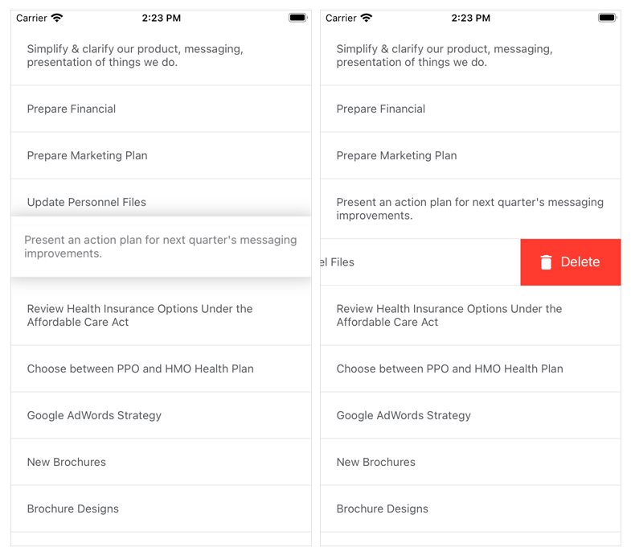

<!-- default file list -->
*Files to look at*:  

**Data**
* [EmployeeTask.cs](./ToDoList/Data/EmployeeTask.cs)
* [EmployeeTaskRepository.cs](./ToDoList/Data/EmployeeTaskRepository.cs)

**View Model**
* [DragDropModel.cs](./ToDoList/ViewModel/DragDropModel.cs)
* [NotificationObject.cs](./ToDoList/ViewModel/NotificationObject.cs)

**Views**
* [MainPage.xaml](./ToDoList/MainPage.xaml)
* [MainPage.xaml.cs](./ToDoList/MainPage.xaml.cs)
* [SwipeItemViewEx.xaml](./ToDoList/SwipeItemViewEx.xaml)
* [SwipeItemViewEx.xaml.cs](./ToDoList/SwipeItemViewEx.xaml.cs)

<!-- default file list end -->
# Reorder and Swipe Items
This example demonstrates how to:
- allow users to [reorder items](https://docs.devexpress.com/MobileControls/402308/xamarin-forms/collection-view/examples/drag-and-drop) in the CollectionView
- use the [Xamarin.Forms SwipeView](https://docs.microsoft.com/en-us/xamarin/xamarin-forms/user-interface/swipeview) component to extend the CollectionView’s UI with additional elements (buttons) that appear when a user swipes a data item (from left to right or right to left) and perform custom actions on tap. 

To run the application:
1. [Obtain your NuGet feed URL](http://docs.devexpress.com/GeneralInformation/116042/installation/install-devexpress-controls-using-nuget-packages/obtain-your-nuget-feed-url).
2. Register the DevExpress NuGet feed as a package source.
3. Restore all NuGet packages for the solution.