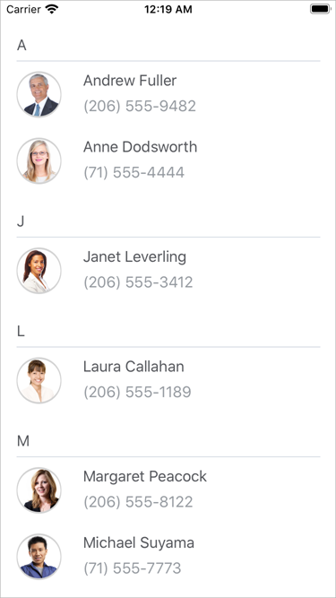

<!-- default file list -->
*Files to look at*:

* [MainPage.xaml](./CollectionViewExample/MainPage.xaml)
* [PersonalInfo.cs](./CollectionViewExample/ViewModel.cs)
<!-- default file list end -->
# CollectionView - Getting Started

The example contains the source code of the application created in the [Getting Started](https://docs.devexpress.com/MobileControls/402075/xamarin-forms/collection-view/getting-started/index) tutorial. It demonstrates the basic functionality of the DevExpress CollectionView for Xamarin.Forms, and includes the following steps:
- [Bind CollectionView to Data](https://docs.devexpress.com/MobileControls/402076/xamarin-forms/collection-view/getting-started/lesson-1-data)
- [Define Item Template](https://docs.devexpress.com/MobileControls/402084/xamarin-forms/collection-view/getting-started/lesson-2-item-template)
- [Sort Data](https://docs.devexpress.com/MobileControls/402102/xamarin-forms/collection-view/getting-started/lesson-3-sort-items)
- [Group Data](https://docs.devexpress.com/MobileControls/402103/xamarin-forms/collection-view/getting-started/lesson-4-group-items)

To run the application:
1. [Obtain your NuGet feed URL](http://docs.devexpress.com/GeneralInformation/116042/installation/install-devexpress-controls-using-nuget-packages/obtain-your-nuget-feed-url).
2. Register the DevExpress NuGet feed as a package source.
3. Restore all NuGet packages for the solution.