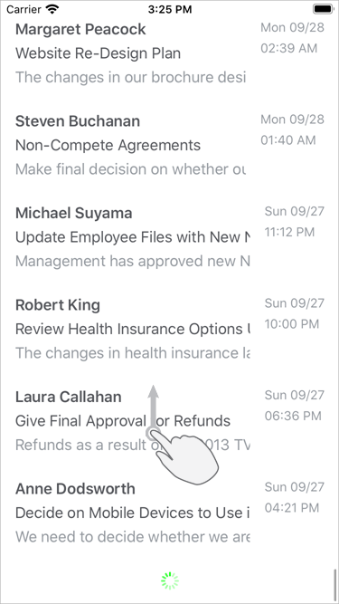

<!-- default file list -->
*Files to look at*:

* [MailMessageRepository.cs](./CollectionView_LoadMore/MailMessageRepository.cs)
* [ViewModel.cs](./CollectionView_LoadMore/ViewModel.cs)
* [MainPage.xaml.cs](./DCollectionView_LoadMore/MainPage.xaml.cs)
* [MainPage.xaml](./CollectionView_LoadMore/MainPage.xaml)
<!-- default file list end -->
# Implement Load-More

In this example, the CollectionView displays a list of mail messages and loads a set of earlier messages when a user scrolls to the last item.

1. Set the [DXCollectionView.IsLoadMoreEnabled](https://docs.devexpress.com/MobileControls/DevExpress.XamarinForms.CollectionView.DXCollectionView.IsLoadMoreEnabled) property to **true** to enable the CollectionView's load-more functionality.  
2. Create a command to be executed when a user scrolls to the bottom of the CollectionView to load more data items. Set the [DXCollectionView.IsRefreshing](https://docs.devexpress.com/MobileControls/DevExpress.XamarinForms.CollectionView.DXCollectionView.IsRefreshing) property to **false** after data is loaded to hide the loading indicator.  
3. Bind the [DXCollectionView.LoadMoreCommand](https://docs.devexpress.com/MobileControls/DevExpress.XamarinForms.CollectionView.DXCollectionView.LoadMoreCommand) property to the created command.  

To run the application:
1. [Obtain your NuGet feed URL](http://docs.devexpress.com/GeneralInformation/116042/installation/install-devexpress-controls-using-nuget-packages/obtain-your-nuget-feed-url).
2. Register the DevExpress NuGet feed as a package source.
3. Restore all NuGet packages for the solution.
