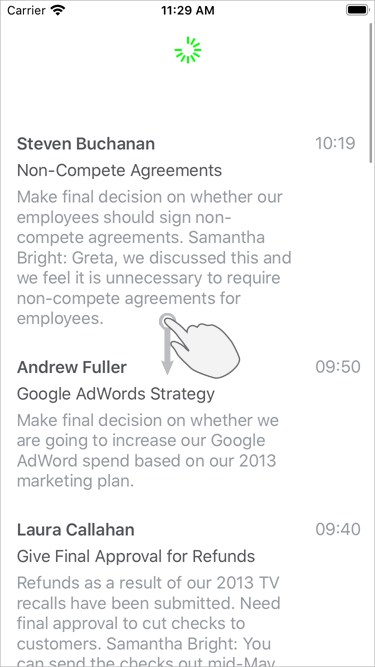

<!-- default file list -->
*Files to look at*:

* [MailMessageRepository.cs](./CollectionView_PullToRefresh/MailMessageRepository.cs)
* [ViewModel.cs](./CollectionView_PullToRefresh/ViewModel.cs)
* [MainPage.xaml.cs](./CollectionView_PullToRefresh/MainPage.xaml.cs)
* [MainPage.xaml](./CollectionView_PullToRefresh/MainPage.xaml)
<!-- default file list end -->
# Implement Pull-to-Refresh

In this example, the CollectionView displays a list of incoming messages that a user can pull down to check for new messages.

1. Set the [DXCollectionView.IsPullToRefreshEnabled](https://docs.devexpress.com/MobileControls/DevExpress.XamarinForms.CollectionView.DXCollectionView.IsPullToRefreshEnabled) property to **true** to enable the CollectionView's pull-to-refresh functionality.  
2. Create a command to be executed when a user pulls the CollectionView down. Set the [DXCollectionView.IsRefreshing](https://docs.devexpress.com/MobileControls/DevExpress.XamarinForms.CollectionView.DXCollectionView.IsRefreshing) property to **false** after data is refreshed to hide the refresh indicator.  
3. Bind the [DXCollectionView.PullToRefreshCommand](https://docs.devexpress.com/MobileControls/DevExpress.XamarinForms.CollectionView.DXCollectionView.PullToRefreshCommand) property to the created command.  

For a complete description, refer to the following help topic: [Implement Pull-to-Refresh](https://docs.devexpress.com/MobileControls/402194/xamarin-forms/collection-view/examples/pull-to-refresh).

To run the application:
1. [Obtain your NuGet feed URL](http://docs.devexpress.com/GeneralInformation/116042/installation/install-devexpress-controls-using-nuget-packages/obtain-your-nuget-feed-url).
2. Register the DevExpress NuGet feed as a package source.
3. Restore all NuGet packages for the solution.
