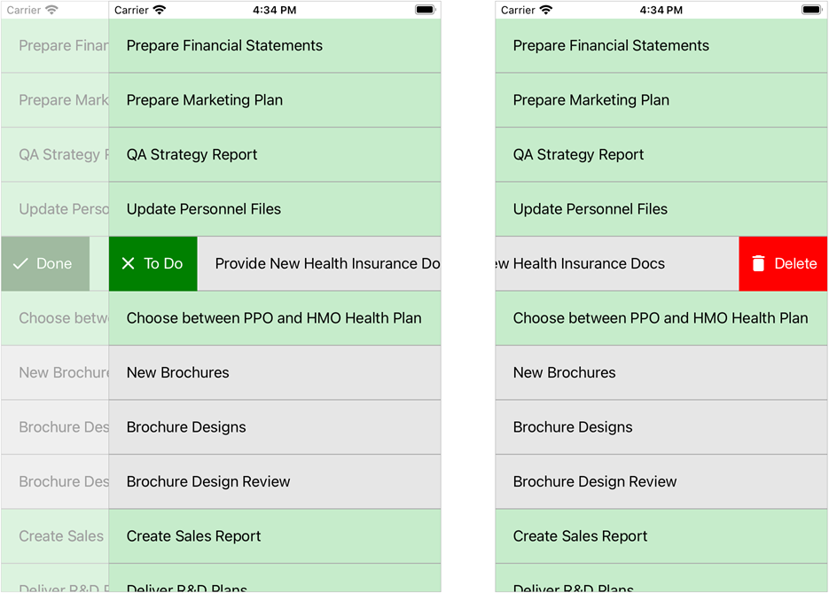

<!-- default file list -->
*Files to look at*:

* [MainPage.xaml](./CollectionView_Swipe/MainPage.xaml)
* [ViewModel.cs](./CollectionView_Swipe/ViewModel.cs)
<!-- default file list end -->
# Define Swipe Actions for Items

This example shows how to define the following two swipe actions for items of the vertical [CollectionView](https://docs.devexpress.com/MobileControls/DevExpress.XamarinForms.CollectionView.DXCollectionView) bound to the list of *tasks*: 
- **Done/To Do**  
	When a user swipes an item from left to right, this button appears on the left side of the item and changes the task state on tap (colors in-progress tasks green, and completed tasks gray). The button caption depends on the task state.
- **Delete**  
	When a user swipes an item from right to left, this button appears on the right side of the item and removes the task on tap.

For a complete description, refer to the following help topic: [Define Swipe Actions for Items](https://docs.devexpress.com/MobileControls/403078/xamarin-forms/collection-view/examples/define-swipe-actions-for-items).

To run the application:
1. [Obtain your NuGet feed URL](http://docs.devexpress.com/GeneralInformation/116042/installation/install-devexpress-controls-using-nuget-packages/obtain-your-nuget-feed-url).
2. Register the DevExpress NuGet feed as a package source.
3. Restore all NuGet packages for the solution.
